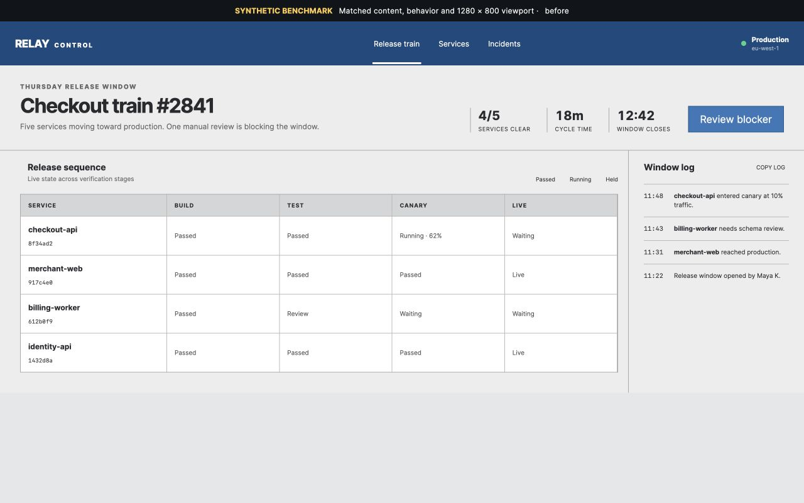
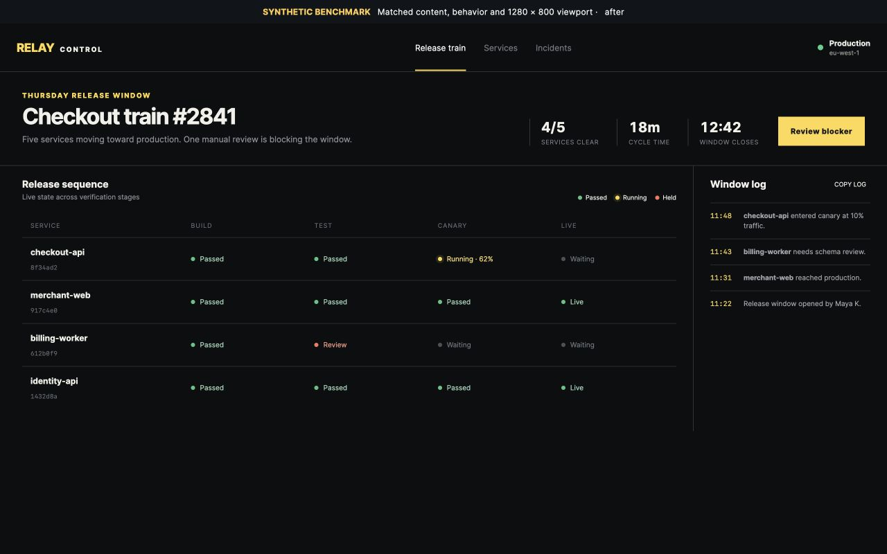
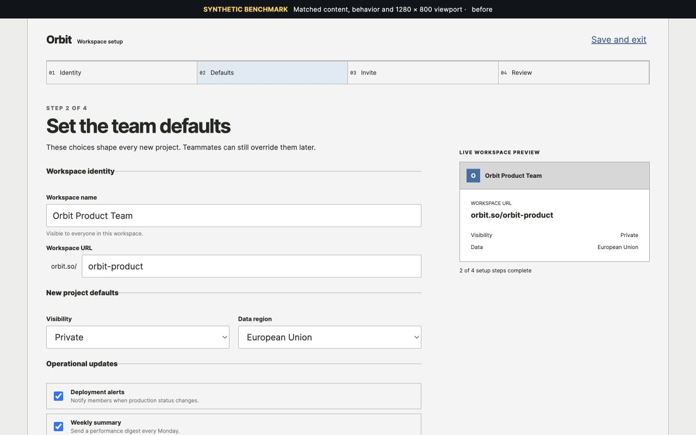
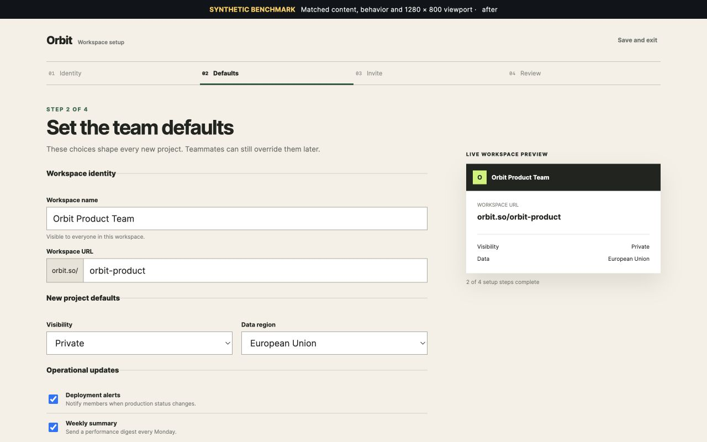
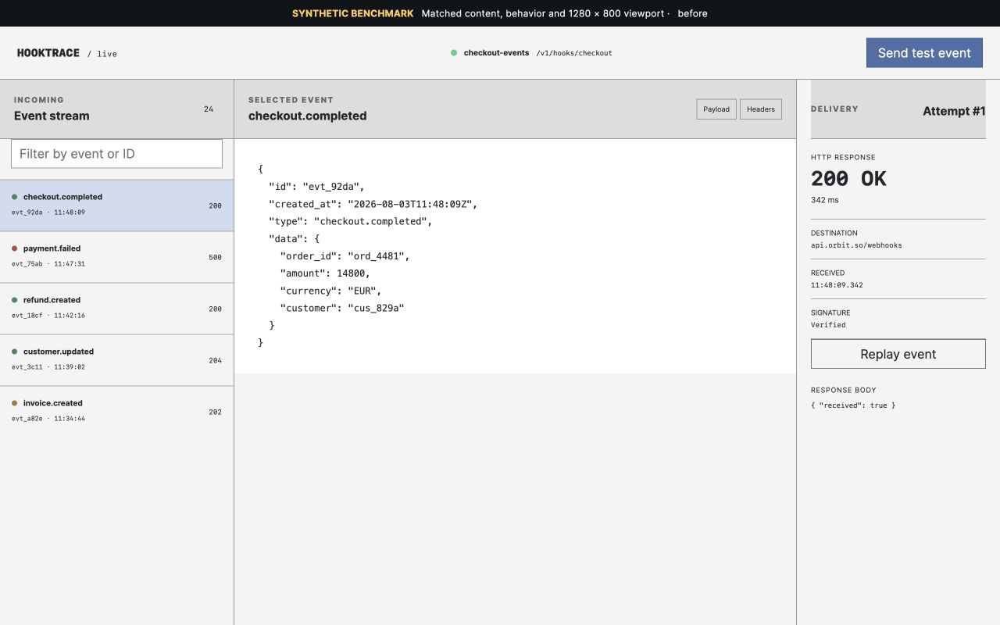
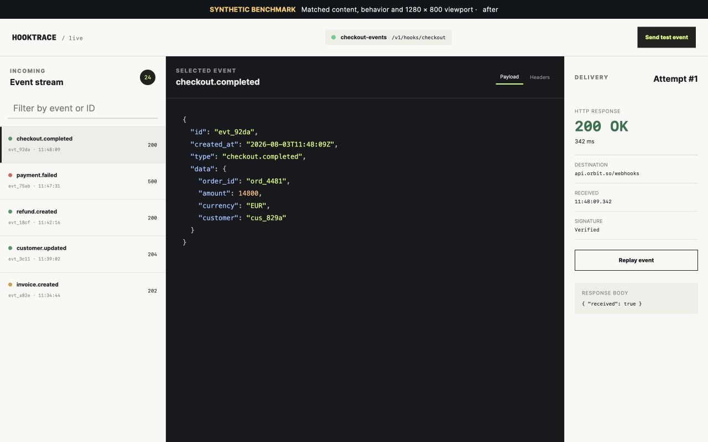

# Functional → Refined

[](https://github.com/AndreXes03/refine-frontend/releases/latest)
[](https://github.com/AndreXes03/refine-frontend/actions/workflows/validate.yml)
[](LICENSE)
[](https://openai.com/codex/)
[](https://code.claude.com/docs/en/skills)

Research-backed visual refactoring for working product interfaces. Maximum perceived-quality gain per reasonable code delta.

Functional → Refined is an agent skill for the awkward last mile between **working** and **ready to ship**. It improves an existing React or Next.js product surface without replacing it with a template, changing its behavior, or turning a focused task into a redesign.

```text
working product UI
        ↓
freeze behavior and constraints
        ↓
diagnose foundation defects
        ↓
compile a persistent visual contract
        ↓
make 3–5 high-impact, low-diff changes
        ↓
prove behavior + responsive fit + visual coherence
        ↓
remember accepted and rejected decisions
```

## Why it is different

The frontend-skill ecosystem already has strong tools for generating bold interfaces, applying aesthetic presets, checking guidelines, and running broad design reviews. Functional → Refined takes a narrower path:

- **Existing-product first** — product UI, dashboards, tools, settings, forms, tables and operational software.
- **Constraint first** — routing, business logic, data, semantics, tests and public APIs are frozen before visual edits.
- **Foundation before expression** — hierarchy, geometry and rhythm are fixed before one optional signature move.
- **Task-specific pattern selection** — the skill records the native interaction topology and rejects generic shells that could fit any product.
- **Persistent visual contract** — decisions survive the current agent session in `.visual-refactor/visual-contract.json`.
- **Human feedback memory** — accepted, modified, rejected and reverted choices are recorded for later passes.
- **Evidence instead of adjectives** — the skill asks for matched before/after states and independent functional, technical-visual and design gates.
- **No fake taste score** — aesthetic judgments remain contextual hypotheses, not invented objective metrics.

## What it produces

```text
.visual-refactor/
├── visual-contract.json   surface, invariants, foundations and signature budget
├── visual-feedback.json   accepted, modified, rejected and reverted decisions
├── change-ledger.md       observed problem → action → files → verification
├── before/                matched baseline evidence
└── after/                 matched final evidence
```

The bundled dependency-free utility creates and validates this workspace:

```bash
python3 scripts/refine_workspace.py init --project /path/to/app --surface "Settings / Profile"
python3 scripts/refine_workspace.py validate --project /path/to/app
python3 scripts/refine_workspace.py validate --strict --project /path/to/app
python3 scripts/refine_workspace.py feedback \
  --project /path/to/app \
  --id VR-TYPE-001 \
  --status accepted \
  --note "Keep the stronger heading contrast."
```

Use plain validation while iterating or opening a legacy workspace. Use `--strict` before sign-off: it rejects placeholder decisions and incomplete product-specific pattern evidence.

## Before / After evidence

Three reproducible synthetic benchmarks show what the skill changes—and what it deliberately leaves alone. Each pair uses one shared HTML document, the same copy, data, controls, state and 1280 × 800 viewport. Only `?variant=before|after` changes the visual layer.

| Surface | Before | After | Material refinement |
| --- | --- | --- | --- |
| Release control room |  |  | time-oriented stage matrix, blocker priority, event chronology |
| Guided workspace setup |  |  | sequential progress, field clarity, live output preview |
| Webhook inspector |  |  | event stream, code payload, delivery context and replay |

Open any fixture locally with `?variant=before` or `?variant=after`. The evidence contract for each case is stored beside its HTML in `evidence.json`; the skill's publication rules live in `references/demonstration-protocol.md`.

## Install the skill

Download `refine-frontend-skill-v0.1.1.zip` from the [latest release](https://github.com/AndreXes03/refine-frontend/releases/latest). The same package works in Codex and Claude Code.

### Codex

Extract the archive so the final folder is:

```text
~/.codex/skills/refine-frontend/
```

Restart Codex, then invoke:

```text
Use $refine-frontend to improve this existing settings screen.
Preserve its behavior and show me matched desktop and mobile evidence.
```

### Claude Code

Extract the archive so the final folder is:

```text
~/.claude/skills/refine-frontend/
```

Restart Claude Code, then invoke `/refine-frontend` or ask Claude to use the skill by name.

## Method

1. Inspect one working surface and its densest realistic state.
2. Freeze functional, technical, content and brand invariants.
3. Classify interaction load, information density, expression need and refinement depth.
4. Map the task topology and reject context-free pattern defaults.
5. Compile a machine-readable foundation, pattern and signature contract.
6. Prioritize three to five coherent changes by impact, recurrence and confidence.
7. Refactor typography, composition, rhythm, semantic color, morphology and states—in that order.
8. Verify behavior, technical visual integrity, contextual design quality and convergence risk as separate gates.
9. Persist implementation decisions and human feedback.

## Research basis

The method does not pretend that design quality can be reduced to a universal checklist.

- Tuch et al. found that visual complexity and prototypicality can shape aesthetic first impressions at very short exposures. The skill translates this into reducing accidental complexity while retaining useful familiarity—not into banning necessary density. [Google Research](https://research.google/pubs/the-role-of-visual-complexity-and-prototypicality-regarding-first-impression-of-websites-working-towards-understanding-aesthetic-judgments/)
- Lavie and Tractinsky distinguished classical aesthetics—order and clarity—from expressive aesthetics—creativity and originality. This informs the mandatory **Foundation Layer** and limited **Signature Layer**. [Ben-Gurion University research portal](https://cris.bgu.ac.il/en/publications/assessing-dimensions-of-perceived-visual-aesthetics-of-web-sites-2/)
- Research on aesthetics and perceived usability is mixed and context-dependent. The skill therefore keeps usability, technical integrity and visual judgment as independent gates. [Tractinsky et al. (2000)](https://cris.bgu.ac.il/en/publications/what-is-beautiful-is-usable-2/) · [Tuch et al. (2012)](https://edoc.unibas.ch/entities/publication/ebcfa3de-1a92-4195-b6fd-ab67d80af2aa)
- Accessibility checks reference WCAG 2.2, but the skill explicitly does not certify conformance. [W3C WCAG 2.2](https://www.w3.org/TR/WCAG22/)

The full translation from evidence to operational rules is bundled inside the skill at `references/research-and-rules.md`.

## v0.1 scope

- existing React and Next.js interfaces;
- Tailwind and shadcn-based systems;
- one surface per pass;
- refinement rather than redesign;
- desktop and mobile evidence;
- no new dependency without approval;
- no image generation;
- no Figma reproduction;
- Codex and Claude Code.

This release does not claim autonomous taste, universal visual quality, WCAG certification, or functional correctness beyond the checks actually run.

## Feedback loop

Real feedback is part of the method. Use the structured [refinement feedback issue](https://github.com/AndreXes03/refine-frontend/issues/new?template=refinement-feedback.yml) to report:

- the surface and framework;
- the accepted or rejected change;
- what improved or regressed;
- the invariant that mattered;
- public before/after evidence when available.

Rules should enter later releases only when they generalize without increasing functional, responsive or accessibility regressions.

## Repository

- `skills/refine-frontend/` — installable Codex and Claude Code skill;
- `examples/` — reproducible matched before/after benchmarks and evidence manifests;
- `scripts/build_release.py` — deterministic ZIP and checksum generation;
- `tests/run_checks.py` — skill, packaging and integration checks;
- `.github/ISSUE_TEMPLATE/refinement-feedback.yml` — structured field feedback.

MIT licensed. Created by [Andrea Salvo](https://www.andreasalvodesigner.it/lab/).
